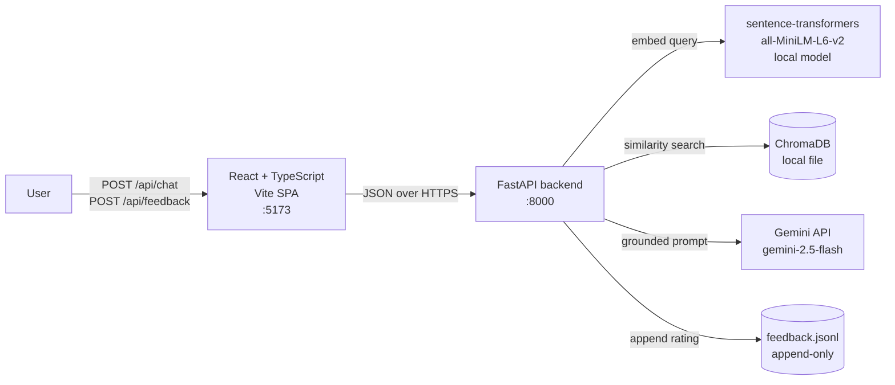

# Architecture

## What this is

A lightweight web chatbot that answers questions about a fictional company
("Lumina") HR knowledge base — leave policy, onboarding, incident
escalation, expenses, benefits, code of conduct, IT security, and remote
work. The architecture is intentionally simple for a POC. The **Scale-out**
section below describes what each piece becomes in production.

## Components

The flow is single-direction. The frontend is a thin chat client; the
backend orchestrates retrieval and generation.

## Request lifecycle: `POST /api/chat`

1. Validate that the latest message is a non-empty user turn (Pydantic +
   route-level checks; surfaces as HTTP 422 on bad input).
2. Embed the latest user message with `all-MiniLM-L6-v2` (local model,
   ~80 MB, lazy-loaded once per process and cached).
3. Run cosine similarity search in ChromaDB; take the top-4 chunks with
   similarity ≥ 0.30. Below that floor we treat the result as "no good
   match", which forces the refusal path.
4. Build the grounded prompt: a static system instruction + a per-request
   user message with the retrieved chunks, the question, and a repeated
   refusal instruction next to the question.
5. Call Gemini with the system prompt as `system_instruction` and the
   conversation history as `contents`. Wrapped in `asyncio.to_thread` so
   the sync SDK doesn't block the FastAPI event loop. Three-attempt
   exponential backoff (1s → 2s → 4s) for transient errors only.
6. Return `{ answer, sources, latency_ms, message_id }`. The frontend
   uses `latency_ms` to display the cost of the call and `message_id`
   to attach feedback later.

## Storage

| Store | What | Why this choice |
|---|---|---|
| `backend/data/chroma/` (ChromaDB) | 78 chunks of HR docs as 384-d embeddings + metadata | Built for cosine retrieval; no DB server to run; persists to disk |
| `backend/data/feedback.jsonl` | Append-only log of `{timestamp, message_id, rating, comment, question, answer}` | Line-atomic on POSIX for short writes; trivial to grep/jq/load into pandas |

**No relational DB.** Adding Postgres for two endpoints would be
infrastructure overhead with no behavioural payoff. The assignment
specifically calls for engineering maturity over LLM perfection.

**No session storage.** Conversation history lives in the React app's
state and is sent in full on every `/api/chat` request. The backend is
stateless — every request is self-contained.

## Stack rationale

| Layer | Choice | Why |
|---|---|---|
| Backend | FastAPI (Python) | Best ecosystem for RAG (sentence-transformers, ChromaDB) and the modern LLM SDKs |
| Embeddings | `all-MiniLM-L6-v2` via sentence-transformers | Free, local, 384-d, well-suited to short policy text; no external API call per query |
| Vector store | ChromaDB | File-backed; cosine metric out of the box; good fit for a single-tenant POC |
| LLM | Google Gemini (`gemini-2.5-flash`) | Free tier, fast, single-key auth |
| Frontend | React + TypeScript + Vite | Required by the assignment; modern default for a SPA |
| Frontend types | Hand-mirrored from `schemas.py` | Zero deps; for production, replace with `openapi-typescript` in CI |

## Scale-out

The current architecture is correct for a POC and wrong for production.
Here's what changes.

| Today (POC) | Production replacement |
|---|---|
| Local ChromaDB file | Managed vector DB (Pinecone, Weaviate, pgvector on managed Postgres). Replicas, HA, concurrent reads. |
| Sync sentence-transformers in-process | Hosted embedding service, or batched GPU worker for ingestion. Eliminates cold-start cost on first query. |
| Single uvicorn process | Multiple workers behind a load balancer. The app is already stateless, so no app-level changes needed. |
| JSONL feedback log | Postgres with unique constraint on `(user_id, message_id)`, retention policy, PII redaction on the comment field. |
| Client-side conversation history | Optional server-side session in Redis or Postgres for cross-device resume + audit. |
| No auth | SSO / OIDC + RBAC. **Per-document access control evaluated at retrieval time** so users only see chunks they're allowed to see. |
| Naive top-k vector retrieval | Hybrid search (BM25 + vector) plus a cross-encoder reranker. Solves the "tabular content underperforms" weakness flagged in `RESPONSIBLE_AI.md`. |
| Synchronous LLM call wrapped in `to_thread` | Dedicated worker pool or task queue for generation. Centralises rate-limit handling and retry logic. |
| Single shared Gemini key | Per-tenant keys, or a proxy that enforces quota and observability before the upstream call. |
| No tests | Unit + integration + e2e (Playwright) with a golden Q&A regression suite for retrieval quality. |
| No CI | GitHub Actions running build + lint + tests on every PR; daily run of the regression suite against the live LLM. |
| No observability | Structured logs, metrics (latency p50/p95/p99, retrieval hit-rate, refusal rate, feedback aggregates), distributed traces. |

The point of the POC is to prove the pipeline works end to end with
explicit governance controls. Each row above is a known migration
path, not a re-architecture.
